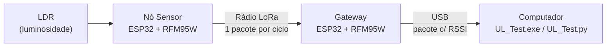

# LoRa_UL — Teste de Uplink LoRa

Material do experimento **UL Test** do curso *Desenvolvimento de Soluções IoT com LoRa e LoRaWAN* (FEE247 — Extensão Unicamp), preparado pelo laboratório **WissTek-IoT**.

Neste experimento, um **Nó Sensor** mede a luminosidade do ambiente e a transmite por rádio LoRa para um **Gateway** (por padrão, a cada segundo). O Gateway entrega cada pacote ao computador pela USB, junto com a potência do sinal recebido (RSSI), e um software mostra os dois valores em tempo real.

Todos os códigos já estão prontos. Você não precisa programar nada, só preparar o ambiente e carregar os firmwares.

> 📄 O passo a passo completo, com capturas de tela de cada etapa, está no PDF [**Preparação do Ambiente UL Teste**](Prepara%C3%A7%C3%A3o%20do%20Ambiente%20UL%20Teste%2026%2009%2019.pdf). Este README resume o experimento e serve de referência rápida. A numeração dos passos é a mesma do PDF.

---

## O que é Uplink (UL)

Em uma rede IoT, a comunicação tem dois sentidos:

| Sentido | Sigla | Origem → Destino | Exemplo |
|---|---|---|---|
| **Uplink** | **UL** | Nó Sensor → Gateway | O sensor envia uma medição |
| Downlink | DL | Gateway → Nó Sensor | O gateway envia um comando ao sensor |

O **uplink** é o sentido principal da maioria das aplicações de IoT: dispositivos espalhados coletam dados e os enviam para serem processados. Este experimento testa **apenas o uplink**. O nó transmite e o gateway só escuta.



A comunicação usa **LoRa ponto a ponto**, direto na camada física, entre dois rádios configurados com os mesmos parâmetros. Não há LoRaWAN aqui: não existe servidor de rede, processo de *join* nem criptografia. Isso deixa o experimento simples o bastante para observar o comportamento do rádio em si.

### Parâmetros do rádio

Os parâmetros ficam nos `#define` do início dos dois arquivos `.ino`. Os valores abaixo são os **padrões do firmware**, usados na preparação do ambiente. **Alterá-los faz parte do aprendizado:** cada parâmetro troca alcance, velocidade e robustez de um jeito diferente, e o efeito aparece no RSSI e no ritmo dos LEDs.

| Parâmetro | `#define` | Padrão | Valores aceitos | Efeito ao alterar |
|---|---|---|---|---|
| Frequência | `FREQUENCY_IN_HZ` | `903E6` (903 MHz) | 902–907,5 MHz e 915–928 MHz (faixas permitidas pela Anatel) | Muda o canal de operação |
| Fator de espalhamento (SF) | `spreadingFactor` | `7` | 7 a 12 | SF maior: mais alcance e robustez, mas muito mais tempo no ar |
| Largura de banda | `signalBandwidth` | `125E3` (125 kHz) | 7,8 kHz a 500 kHz | Banda menor: mais sensibilidade, mas mais tempo no ar. Metade da banda dobra o tempo no ar |
| Taxa de codificação | `codingRateDenominator` | `8` (4/8) | 5 a 8 (4/5 a 4/8) | Denominador maior: mais bits de redundância para corrigir erros, mais tempo no ar |
| Potência de transmissão | `txPower` | `17` (dBm) | 2 a 20 dBm | Mais potência: RSSI maior no gateway, mais consumo de energia |

Depois de alterar, **grave o firmware de novo nas placas**. Duas regras:

- **Frequência, SF e largura de banda precisam ser iguais no Nó Sensor e no Gateway.** Se forem diferentes, o gateway simplesmente não recebe nada: o LED verde para de piscar.
- **A potência de transmissão não precisa ser igual.** No uplink, só a do Nó Sensor importa, porque o Gateway apenas recebe. A taxa de codificação viaja no cabeçalho de cada pacote LoRa, então o gateway a identifica sozinho. Ainda assim, manter os dois arquivos iguais evita confusão.

#### Tempo no ar e ritmo de transmissão

Cada pacote leva um tempo para ser transmitido, o **tempo no ar**. O Nó Sensor espera a transmissão terminar e só então aguarda o `delay(1000)`. Por isso, o intervalo real entre pacotes é **1 segundo + tempo no ar**. Com o SF padrão isso passa despercebido, mas com SF alto fica bem visível no LED vermelho.

Tempo no ar para o pacote de 20 bytes, com 125 kHz e taxa de codificação 4/8:

| SF | Tempo no ar | Intervalo entre pacotes |
|---|---|---|
| **7** (padrão) | ≈ 70 ms | ≈ 1,1 s |
| 8 | ≈ 123 ms | ≈ 1,1 s |
| 9 | ≈ 247 ms | ≈ 1,3 s |
| 10 | ≈ 428 ms | ≈ 1,4 s |
| 11 | ≈ 856 ms | ≈ 1,9 s |
| 12 | ≈ 1,7 s | ≈ 2,7 s |

Cada SF acima **dobra** o tempo no ar: o sinal fica mais robusto e alcança mais longe, mas ocupa o canal por mais tempo e gasta mais bateria. O intervalo de 1 segundo também pode ser alterado, no `delay(1000)` do fim do `loop()` do Nó Sensor.

### O pacote de UL

O pacote tem 20 bytes. O Nó Sensor preenche a luminosidade e um contador; o Gateway, ao receber, grava o RSSI medido antes de enviar tudo pela USB:

| Bytes | Conteúdo | Quem preenche |
|---|---|---|
| 0 e 2 | RSSI de uplink, codificado em 1 byte (repetido nas duas posições) | Gateway |
| 12–13 | Contador de pacotes enviados (MSB, LSB) | Nó Sensor |
| 18–19 | Luminosidade: leitura do LDR no ADC do ESP32 (MSB, LSB) | Nó Sensor |
| demais | Reservados, sempre zero neste experimento | — |

O contador (bytes 12–13) é transmitido, mas o `UL_Test.py` não o exibe.

### RSSI — a potência do sinal recebido

O **RSSI** (*Received Signal Strength Indicator*) é a potência com que o sinal do Nó Sensor chega ao Gateway, em **dBm**. Os valores são negativos, e **quanto mais perto de zero, mais forte o sinal**:

- Com os dois kits lado a lado na bancada, é normal ver valores altos, como **−27 dBm** (o exemplo do PDF).
- O sinal enfraquece com a distância e com obstáculos como paredes, e o RSSI cai.

Para caber em um único byte do pacote, o Gateway converte o RSSI com `byte = (RSSI + 74) × 2`. O software faz a conversão inversa. Essa codificação representa valores de **−138 dBm a −10,5 dBm**, em passos de 0,5 dB. Sinais mais fortes que −10,5 dBm aparecem como −10,5 dBm.

---

## Conteúdo do repositório

| Arquivo / pasta | Para que serve |
|---|---|
| `1_Sensor_LoRa_Uplink/` | Firmware do **Nó Sensor**: lê o LDR e transmite o pacote a cada segundo |
| `2_Gateway_LoRa_Uplink/` | Firmware do **Gateway**: recebe o pacote, mede o RSSI e envia pela USB |
| `UL_Test.exe` | Ferramenta de teste pronta para Windows. Conecta ao Gateway e mostra luminosidade e RSSI nas abas **Gráficos** e **Rede**. **Não precisa de Python** |
| `UL_Test.py` | Ferramenta de teste em Python, **independente do `.exe`**, com interface própria. Mostra luminosidade e RSSI em gráficos e serve para **validar a instalação do Python** e das bibliotecas |
| `instaladorBibliotecasPython.bat` | Instala de uma vez todas as bibliotecas Python do curso |
| `Preparação do Ambiente UL Teste 26 09 19.pdf` | Guia completo de preparação do ambiente, com capturas de tela |
| `.gitattributes` | Arquivo de configuração do GitHub. Não é usado no experimento |

---

## Kit-LoRa

O curso usa um kit didático, a placa **PK LoRa V3**. Nó Sensor e Gateway usam a mesma placa e o mesmo esquema elétrico:

- ESP32
- Módulo de rádio **RFM95W** (modulação LoRa)
- LDR (sensor de luminosidade)
- Botão
- Três LEDs
- Soquete para acesso aos pinos do ESP32

Neste experimento, o **LED vermelho** do Nó Sensor indica transmissão e o **LED verde** do Gateway indica recepção. Por ser um kit didático, a antena não tem casamento de impedância.

---

## Preparação do ambiente

### Requisitos

| Item | Versão | Observação |
|---|---|---|
| Sistema operacional | Windows 10 ou 11 | O `UL_Test.exe` só roda no Windows |
| Arduino IDE | 2.2.1 ou superior | [arduino.cc/en/software](https://www.arduino.cc/en/software/) |
| Pacote de placas ESP32 | `esp32` by Espressif Systems, **3.3.7** | Instalado pelo *Boards Manager* |
| Biblioteca LoRa | `LoRa` by Sandeep Mistry | Instalada pelo *Library Manager* |
| Python | 3.11.8 ou superior | Necessário apenas para o `UL_Test.py` |
| Cabos | 2 cabos Micro USB | Um para cada placa |

### Passo 1 — Kit-LoRa

Separe o Nó Sensor e o Gateway. Os detalhes do kit estão no **Apêndice 1** do PDF.

### Passo 2 — Plataforma Arduino

Instale o Arduino IDE, o pacote de placas do ESP32 e a biblioteca LoRa. O procedimento completo está no **Apêndice 2** do PDF. Em resumo:

1. Em **File → Preferences → Additional boards manager URLs**, adicione:
   ```
   https://raw.githubusercontent.com/espressif/arduino-esp32/gh-pages/package_esp32_index.json
   ```
2. Em **Tools → Board → Boards Manager**, procure `esp32` e instale **esp32 by Espressif Systems** na versão **3.3.7**.
3. No **Library Manager**, procure `LoRa` e instale **LoRa by Sandeep Mistry**.

### Passo 3 — Baixar os códigos

Na página deste repositório, clique em **`<> Code` → `Download ZIP`**. Salve o arquivo em uma pasta da disciplina e descompacte. A pasta extraída se chamará `LoRa_UL-main`.

### Passo 4 — Carregar o firmware do Nó Sensor

1. Conecte **somente o Nó Sensor** na USB. Assim só existe uma porta COM e não há como confundir as placas.
2. Abra `1_Sensor_LoRa_Uplink/1_Sensor_LoRa_Uplink.ino` com dois cliques.
3. Em **Tools**, selecione a placa **ESP32 Dev Module** e a porta COM do Nó Sensor.
4. Clique em **Upload** (seta →) e aguarde a compilação e a gravação.

✅ **Resultado esperado:** o **LED vermelho** pisca a cada 1 segundo. O nó está transmitindo.

Depois disso, o Nó Sensor só precisa de energia. Ele pode ficar ligado no computador, em um powerbank ou em um carregador de celular.

### Passo 5 — Carregar o firmware do Gateway

1. Conecte o Gateway em **outra porta USB**. Agora existem duas portas COM.
2. Abra `2_Gateway_LoRa_Uplink/2_Gateway_LoRa_Uplink.ino`.
3. Em **Tools**, selecione **ESP32 Dev Module** e a porta COM **nova**, que é a do Gateway.
4. Clique em **Upload**.

✅ **Resultado esperado:** o **LED verde** do Gateway pisca junto com o vermelho do Nó Sensor. O gateway está recebendo os pacotes.

> ⚠️ Cada computador atribui números de COM diferentes. No PDF o exemplo é COM15 para o Nó Sensor e COM5 para o Gateway, mas os seus serão outros. Anote qual é qual.

### Passo 6 — Executar o `UL_Test.exe`

1. Na pasta `LoRa_UL-main`, abra o `UL_Test.exe` com dois cliques.
2. Selecione a porta COM **do Gateway** e clique para conectar ao gateway.

✅ **Resultado esperado:** o software mostra a luminosidade e o RSSI de cada pacote recebido. A aba **Gráficos** traz a luminosidade ao longo do tempo, e a aba **Rede**, o RSSI.

> O `UL_Test.exe` não é assinado digitalmente. Na primeira execução, o Windows pode exibir *"O Windows protegeu o computador"*. Clique em **Mais informações → Executar assim mesmo**.

### Passo 7 — Instalar o Python e as bibliotecas

1. Instale o Python 3.11.8 ou superior, pelo site oficial. Durante a instalação, **marque a opção "Add Python to PATH"**. Os detalhes estão no **Apêndice 3** do PDF.
2. Execute o `instaladorBibliotecasPython.bat` com dois cliques. Ele instala e testa todas as bibliotecas do curso:

   | Biblioteca | Uso |
   |---|---|
   | `pyserial` | Comunicação com a porta serial (USB) |
   | `matplotlib` | Gráficos |
   | `pandas` | Manipulação de tabelas de dados |
   | `schedule` | Agendamento de tarefas |
   | `Pillow` | Imagens |
   | `customtkinter` | Interface gráfica |
   | `paho-mqtt` | Comunicação MQTT |

   Para o `UL_Test.py`, bastam `pyserial` e `matplotlib`. As demais serão usadas nos próximos experimentos do curso.

   Se preferir instalar manualmente, abra o Prompt de Comando e rode:
   ```
   pip install pyserial pandas matplotlib schedule Pillow customtkinter paho-mqtt
   ```

### Passo 8 — Testar o ambiente Python

1. Abra o **IDLE** do Python (pesquise "IDLE" no menu Iniciar).
2. Abra o arquivo `UL_Test.py` e execute com **Run → Run Module** (ou `F5`).
3. Selecione a porta COM **do Gateway** e clique em **INICIAR**.

✅ **Resultado esperado:** os gráficos de luminosidade e de RSSI começam a ser desenhados, e os valores atuais aparecem nos quadros à direita. O ambiente Python está pronto para os próximos experimentos.

---

## Testes realizados no experimento

Ao final da preparação, o experimento terá sido validado em três níveis. Cada um confirma uma parte diferente da cadeia:

| # | Teste | Como verificar | O que confirma |
|---|---|---|---|
| 1 | **Transmissão e recepção de rádio** | O LED vermelho do Nó Sensor e o LED verde do Gateway piscam juntos, a cada ~1 s | O enlace LoRa funciona: o nó transmite e o gateway recebe |
| 2 | **Recepção no computador** | O `UL_Test.exe` exibe a luminosidade e o RSSI | O Gateway está entregando os pacotes pela USB e os dados chegam íntegros |
| 3 | **Ambiente Python** | O `UL_Test.py` exibe a luminosidade e o RSSI | O Python e as bibliotecas estão instalados corretamente |

`UL_Test.exe` e `UL_Test.py` são **duas ferramentas diferentes**, com interfaces próprias. As duas leem os pacotes que o Gateway envia pela USB. O `.exe` roda sem instalar nada; o `.py` depende do ambiente Python, e por isso serve para validá-lo.

### Interpretando os valores

- **Luminosidade:** é a leitura bruta do LDR no ADC de 12 bits do ESP32, de **0 a 4095**. Ela não está em lux. Cubra o LDR com a mão ou aponte uma lanterna para ele e observe o gráfico reagir.
- **RSSI:** com as placas próximas, o sinal chega forte, como os −27 dBm do exemplo do PDF. Afaste o Nó Sensor do Gateway, ou coloque um obstáculo entre eles, e observe o RSSI cair.

---

## Solução de problemas

| Problema | Causa provável | O que fazer |
|---|---|---|
| A porta COM não aparece no Arduino IDE | O Windows não reconheceu o conversor USB-serial da placa | Instale o driver. Abra o **Gerenciador de Dispositivos → Portas (COM e LPT)** e veja o nome do dispositivo: **CP210x** → driver da Silicon Labs (**Apêndice 4**); **CH340** → driver CH340 (**Apêndice 5**) |
| A placa **ESP32 Dev Module** não aparece | Pacote de placas não instalado | Refaça o Passo 2, conferindo a URL do *Boards Manager* |
| Erro de compilação `LoRa.h: No such file` | Biblioteca LoRa não instalada | Instale **LoRa by Sandeep Mistry** no Library Manager |
| LED vermelho pisca, mas o verde não | Gateway sem firmware, ou parâmetros de rádio diferentes entre as placas | Confira se **frequência, SF e largura de banda** são iguais nos dois `.ino` e regrave o firmware do Gateway |
| LED vermelho pisca mais devagar que 1 s | SF alto, ou banda estreita | Esperado: o intervalo é 1 s + tempo no ar. Veja a tabela de [tempo no ar](#tempo-no-ar-e-ritmo-de-transmissão) |
| O software não mostra dados | Porta errada selecionada, ou porta ocupada | Selecione a COM **do Gateway**, não a do Nó Sensor. **Feche o Serial Monitor do Arduino IDE**: só um programa por vez pode usar a mesma porta COM |
| A placa parou de responder | Travamento do ESP32 | Aperte o botão de **reset** da placa |
| O `.bat` diz que o Python não foi encontrado | Python fora do PATH | Reinstale o Python marcando **"Add Python to PATH"** |

---

**WissTek-IoT** · FEE247 — Desenvolvimento de Soluções IoT com LoRa e LoRaWAN · Extensão Unicamp
